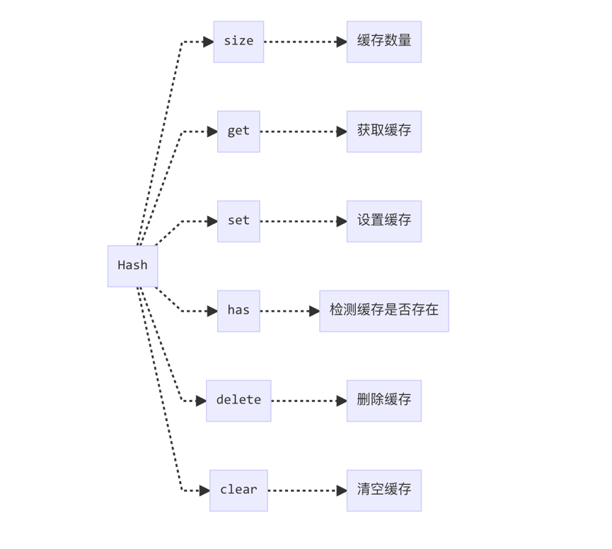

# lodash源码分析之List缓存

> 昨日我沿着河岸/漫步到/芦苇弯腰喝水的地方
>
> 顺便请烟囱/在天空为我写一封长长的信
>
> 潦是潦草了些/而我的心意/则明亮亦如你窗前的烛光/稍有暧昧之处/势所难免/因为风的缘故
>
> ——洛夫《因为风的缘故》

本文为读 lodash 源码的第七篇，后续文章会更新到这个仓库中，欢迎 star：[pocket-lodash](https://github.com/yeyuqiudeng/pocket-lodash)

gitbook也会同步仓库的更新，gitbook地址：[pocket-lodash](https://www.gitbook.com/book/yeyuqiudeng/pocket-lodash/details)

## 作用与用法

在之前的《[lodash源码分析之Hash缓存](hash.md)》介绍过用 `Hash` 做缓存的情况，在这篇文章中介绍过，lodash 是想要实现和 `Map` 一样的接口。

`Hash` 其实是用对象来做缓存，但是对象有一个局限，它的 `key` 只能是字符串或者 `Symbol` 类型，但是 `Map` 是支持各种类型的值来作为 `key`，因此 `Hash` 缓存无法完全模拟 ` Map` 的行为，当遇到 `key` 为数组、对象等类型时，`Hash` 就无能为力了。

因此，在不支持 `Map` 的环境下，`lodash` 实现了 `ListCache` 来模拟，`ListCache` 本质上是使用一个二维数组来储存数据。

`ListCache` 的调用方式和 `Hash` 一致：

```javascript
new ListCache([
  [{key: 'An Object Key'}, 1],
  [['An Array Key'],2],
  [function(){console.log('A Function Key')},3]
])
```

返回的结果如下：

```javascript
{
  size: 3,
  __data__: [
    [{key: 'An Object Key'}, 1],
    [['An Array Key'],2],
    [function(){console.log('A Function Key')},3]
  ]
}
```

结构和 `Hash` 类似，但是 `__data__` 变成了数组。

## 接口设计

`ListCache` 的接口与 `Hash` 一样，同样实现了 `Map` 的数据管理接口。



## 依赖

```javascript
import assocIndexOf from './assocIndexOf.js'
```

《[lodash源码分析之自减的两种形式](assocIndexOf.md)》

## 源码分析

```javascript
class ListCache {

  constructor(entries) {
    let index = -1
    const length = entries == null ? 0 : entries.length

    this.clear()
    while (++index < length) {
      const entry = entries[index]
      this.set(entry[0], entry[1])
    }
  }

  clear() {
    this.__data__ = []
    this.size = 0
  }

  delete(key) {
    const data = this.__data__
    const index = assocIndexOf(data, key)

    if (index < 0) {
      return false
    }
    const lastIndex = data.length - 1
    if (index == lastIndex) {
      data.pop()
    } else {
      data.splice(index, 1)
    }
    --this.size
    return true
  }

  get(key) {
    const data = this.__data__
    const index = assocIndexOf(data, key)
    return index < 0 ? undefined : data[index][1]
  }

  has(key) {
    return assocIndexOf(this.__data__, key) > -1
  }

  set(key, value) {
    const data = this.__data__
    const index = assocIndexOf(data, key)

    if (index < 0) {
      ++this.size
      data.push([key, value])
    } else {
      data[index][1] = value
    }
    return this
  }
}
```

### constructor

构造器跟 `Hash` 一模一样，都是先调用 `clear` 方法，然后调用 `set` 方法，往缓存中加入初始数据。

这里调用 `clear` 方法并不是说为了清除数据，还没开始使用这个类，肯定是没有数据的，而是为了初始化 `__data__` 和 `size` 这两个属性。

### clear

```javascript
clear() {
  this.__data__ = []
  this.size = 0
}
```

`clear` 是为了清空缓存。

其实就是将容器 `__data__` 设置成空数组，在 `Hash` 中是设置为空对象，将缓存数量 `size` 设置为 `0` 。

### has

```javascript
has(key) {
  return assocIndexOf(this.__data__, key) > -1
}
```

`has` 用来判断是否已经有缓存数据，如果缓存数据已经存在，则返回 `true` 。

在之前的文章中已经介绍过，`assocIndexOf` 检测的是对应 `key` 的 `[key,value]` 数组在二维数组中的索引，其行为跟 `indexOf` 一致，不存在于二维数组中时，返回 `-1` ，否则返回索引值。因此可以用是否大于 `-1` 来判断指定 `key` 的数据是否已经被缓存。

### set

```javascript
set(key, value) {
  const data = this.__data__
  const index = assocIndexOf(data, key)

  if (index < 0) {
    ++this.size
    data.push([key, value])
  } else {
    data[index][1] = value
  }
  return this
}
```

`set` 用来增加或者更新需要缓存的值。`set` 的时候需要同时维护 `size` 和缓存的值。

跟 `has` 一样，调用 `assocIndexOf` 找到指定 `key` 的索引值，如果小于 `0` ，则表明指定的 `key` 尚未缓存，需要将缓存数量 `size` 加 `1` ，然后将缓存数据加入到 `this.__data__` 的末尾。

否则更新 `value` 即可。

强迫症看到 `has` 用大于 `-1` 来判断，而这里用小于 `0` 来判断可能会相当难受。

### get

```javascript
get(key) {
  const data = this.__data__
  const index = assocIndexOf(data, key)
  return index < 0 ? undefined : data[index][1]
}
```

`get` 方法是从缓存中取值。

如果缓存中存在值，则返回缓存中的值，否则返回 `undefined` 。

### delete

```javascript
delete(key) {
  const data = this.__data__
  const index = assocIndexOf(data, key)

  if (index < 0) {
    return false
  }
  const lastIndex = data.length - 1
  if (index == lastIndex) {
    data.pop()
  } else {
    data.splice(index, 1)
  }
  --this.size
  return true
}
```

`delete` 方法用来删除指定 `key` 的缓存。成功删除返回 `true`， 否则返回 `false`。 删除操作同样需要维护 `size` 属性。

首先调用 `assocIndexOf` 来找到缓存的索引。

如果索引小于 `0` ，表明没有缓存，删除不成功，直接返回 `false` 。

如果要删除的缓存是缓存中的最后一项，则直接调用 `pop` 方法，将缓存删除，否则将调用 `splice` 方法将对应位置的缓存删除。

为什么不直接都用 `splice` 来删除数据呢？因为 `pop` 的性能比 `splice` 好，我简单测了一下，大概快 `17%` 左右。

有兴趣的可以看下 `pop` 和 `splice` 的规范，`splice` 要比 `pop` 做的事情要多。

从这里又看出了 `lodash` 对性能的极致追求。

最后将缓存数量 `size` 减少 `1` 。

## 参考

1. [Set 和 Map 数据结构](http://es6.ruanyifeng.com/#docs/set-map#Map)
2. [MDN: 使用对象](https://developer.mozilla.org/zh-CN/docs/Web/JavaScript/Guide/Working_with_Objects)
3. [ECMAScript5.1中文版 + ECMAScript3 + ECMAScript（合集）](http://yanhaijing.com/es5)

## License

[署名-非商业性使用-禁止演绎 4.0 国际 (CC BY-NC-ND 4.0)](http://creativecommons.org/licenses/by-nc-nd/4.0/)

最后，所有文章都会同步发送到微信公众号上，欢迎关注,欢迎提意见：   

作者：对角另一面