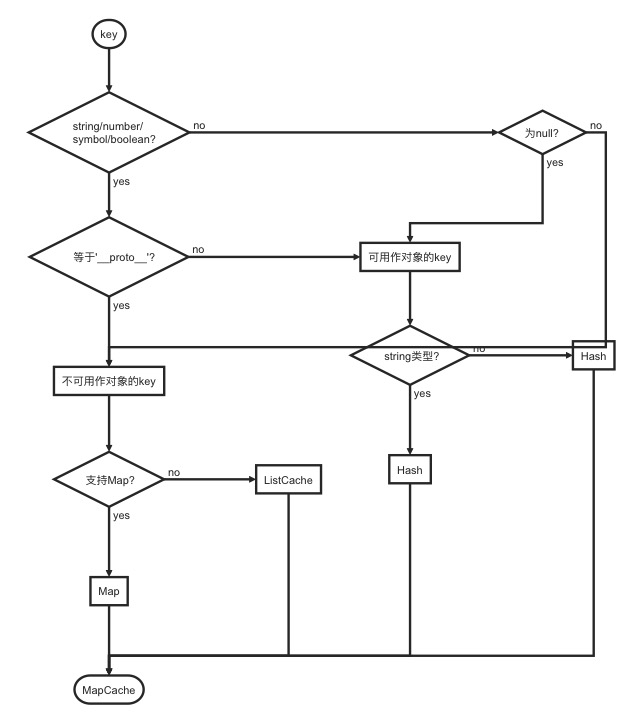

# lodash源码分析之缓存方式的选择

> 每个人心里都有一团火，路过的人只看到烟。
>
> ——《至爱梵高·星空之谜》

本文为读 lodash 源码的第八篇，后续文章会更新到这个仓库中，欢迎 star：[pocket-lodash](https://github.com/yeyuqiudeng/pocket-lodash)

gitbook也会同步仓库的更新，gitbook地址：[pocket-lodash](https://www.gitbook.com/book/yeyuqiudeng/pocket-lodash/details)

## 前言

在《[lodash源码分析之Hash缓存](hash.md)》和《[lodash源码分析之List缓存](internal/ListCache.md)》介绍了 lodash 的两种缓存方式，这两种缓存方式都实现了和 `Map` 一致的数据管理接口，其中 `List` 缓存只在不支持 `Map` 的环境中使用，那何时使用 `Hash` 缓存，何时使用 `Map` 或者 `List` 缓存呢？这就是 `MapCache` 类所需要做的事情。

## 缓存方式的选择

从之前的分析可以看出，`Hash` 缓存完全可以用 `List` 缓存或者 `Map` 来代替，为什么 lodash 不干脆统一用一种缓存方式呢？

原因是在数据量较大时，对象的存取比 `Map` 或者数组的性能要好。

因此，ladash 在能够用 `Hash` 缓存时，都尽量使用 `Hash` 缓存，而能否使用 `Hash` 缓存的关键是 `key` 的类型。

以下便为 lodash 决定使用缓存方式的流程：



首先，判断 `key` 的类型，以是否为 `string/number/symbol/boolean` 类型为成两拨，如果是以上的类型，再判断 `key` 是否等于 `__proto__` ，如果不是 `__proto__` ，则使用 `Hash` 缓存。不能为 `__proto__` 的原因是，大部分 JS 引擎都以这个属性来保存对象的原型。

如果不是以上的类型，则判断 `key` 是否为 `null`，如果为 `null` ，则依然使用 `Hash` 缓存，其余的则使用 `Map` 或者 `List` 缓存。

从上面的流程图还可以看到，在可以用 `Hash` 来缓存的 `key` 中，还以是否为 `string` 类型分成了两个 `Hash` 对象来缓存数据，为什么要这样呢？

我们都知道，对象的 `key` 如果不是字符串或者 `Symbol` 类型时，会转换成字符串的形式，因此如果缓存的数据中同时存在像数字 `1` 和字符串 `'1'` 时，数据都会储存在字符串 `'1'` 上。这两个不同的键值，最后获取的都是同一份数据，这明显是不行的，因此需要将要字符串的 `key` 和其他需要转换类型的 `key` 分开两个 `Hash` 对象储存。

## 作用与用法

`MapCache` 所做的事情有点像函数重载，其调用方式和 `Hash` 、`Map` 及 `ListCache` 一致。

```javascript
new MapCache([
  ['key', 'value'],
  [{key: 'An Object Key'}, 1],
  [Symbol(),2]
])
```

所返回的结果如下：

```javascript
{
  size: 3,
  __data__: {
    string: {
      ... 
    },
    hash: {
      ...
    },
    map: {
      ...  
    }
  }
}
```

可以看到，`__data__` 里根据 `key` 的类型分成了 `string` 、`hash` 和 `map` 三种类型来储存数据。其中 `string` 和 `hash` 都是 `Hash` 的实例，而 `map` 则是 `map` 或 `ListCache` 的实例。

## 接口设计

`MapCache` 同样实现了跟 `Map` 一致的数据管理接口，如下：


## 依赖

```javascript
import Hash from './Hash.js'
import ListCache from './ListCache.js'
```

《[lodash源码分析之Hash缓存](hash.md)》

《[lodash源码分析之List缓存](internal/ListCache.md)》

## 源码分析

```javascript
function getMapData({ __data__ }, key) {
  const data = __data__
  return isKeyable(key)
    ? data[typeof key == 'string' ? 'string' : 'hash']
    : data.map
}

function isKeyable(value) {
  const type = typeof value
  return (type == 'string' || type == 'number' || type == 'symbol' || type == 'boolean')
    ? (value !== '__proto__')
    : (value === null)
}

class MapCache {

  constructor(entries) {
    let index = -1
    const length = entries == null ? 0 : entries.length

    this.clear()
    while (++index < length) {
      const entry = entries[index]
      this.set(entry[0], entry[1])
    }
  }

  clear() {
    this.size = 0
    this.__data__ = {
      'hash': new Hash,
      'map': new (Map || ListCache),
      'string': new Hash
    }
  }

  delete(key) {
    const result = getMapData(this, key)['delete'](key)
    this.size -= result ? 1 : 0
    return result
  }

  get(key) {
    return getMapData(this, key).get(key)
  }

  has(key) {
    return getMapData(this, key).has(key)
  }

  set(key, value) {
    const data = getMapData(this, key)
    const size = data.size

    data.set(key, value)
    this.size += data.size == size ? 0 : 1
    return this
  }
}
```

### 是否使用Hash

```javascript
function isKeyable(value) {
  const type = typeof value
  return (type == 'string' || type == 'number' || type == 'symbol' || type == 'boolean')
    ? (value !== '__proto__')
  : (value === null)
}
```

这个函数用来判断是否使用 `Hash` 缓存。返回 `true` 表示使用 `Hash` 缓存，返回 `false` 则使用 `Map` 或者 `ListCache` 缓存。

这个在流程图上已经解释过，不再作详细的解释。

### 获取对应缓存方式的实例

```javascript
function getMapData({ __data__ }, key) {
  const data = __data__
  return isKeyable(key)
    ? data[typeof key == 'string' ? 'string' : 'hash']
    : data.map
}
```

这个函数根据 `key` 来获取储存了该 `key` 的缓存实例。

`__data__` 即为 `MapCache` 实例中的 `__data__` 属性的值。

如果使用的是 `Hash` 缓存，则类型为字符串时，返回 `__data__` 中的 `string` 属性的值，否则返回 `hash` 属性的值。这两者都为 `Hash` 实例。 

否则返回 `map` 属性的值，这个可能是 `Map` 实例或者 `ListCache` 实例。

### constructor

```javascript
constructor(entries) {
  let index = -1
  const length = entries == null ? 0 : entries.length

  this.clear()
  while (++index < length) {
    const entry = entries[index]
    this.set(entry[0], entry[1])
  }
}
```

构造器跟 `Hash` 和 `ListCache` 一模一样，都是先调用 `clear` 方法，然后调用 `set` 方法，往缓存中加入初始数据。

### clear

```javascript
clear() {
  this.size = 0
  this.__data__ = {
    'hash': new Hash,
    'map': new (Map || ListCache),
    'string': new Hash
  }
}
```

`clear` 是为了清空缓存。

这里值得注意的是 `__data__` 属性，使用 `hash` 、`string` 和 `map` 来保存不同类型的缓存数据，它们之间的区别上面已经论述清楚。

这里也可以清晰地看到，如果在支持 `Map` 的环境中，会优先使用 `Map` ，而不是 `ListCache`。

### has

```javascript
has(key) {
  return getMapData(this, key).has(key)
}
```

`has` 用来判断是否已经有缓存数据，如果缓存数据已经存在，则返回 `true` 。

这里调用了 `getMapData` 方法，获取到对应的缓存实例（`Hash` 、`Map` 或者 `ListCache` 的实例），然后调用的是对应实例中的 `has` 方法。

### set

```javascript
set(key, value) {
  const data = getMapData(this, key)
  const size = data.size

  data.set(key, value)
  this.size += data.size == size ? 0 : 1
  return this
}
```

`set` 用来增加或者更新需要缓存的值。`set` 的时候需要同时维护 `size` 和缓存的值。

这里除了调用对应的缓存实例的 `set` 方法来维护缓存的值外，还需要维护自身的 `size` 属性，如果增加值，则加 `1` 。

### get

```javascript
get(key) {
  return getMapData(this, key).get(key)
}
```

`get` 方法是从缓存中取值。

同样是调用对应的缓存实例中的 `get` 方法。

### delete

```javascript
delete(key) {
  const result = getMapData(this, key)['delete'](key)
  this.size -= result ? 1 : 0
  return result
}
```

`delete` 方法用来删除指定 `key` 的缓存。成功删除返回 `true`， 否则返回 `false`。 删除操作同样需要维护 `size` 属性。

同样是调用对应缓存实例中的 `delete` 方法，如果删除成功，则需要将自身的 `size` 的值减少 `1` 。

## 参考

## License

[署名-非商业性使用-禁止演绎 4.0 国际 (CC BY-NC-ND 4.0)](http://creativecommons.org/licenses/by-nc-nd/4.0/)

最后，所有文章都会同步发送到微信公众号上，欢迎关注,欢迎提意见：   

作者：对角另一面