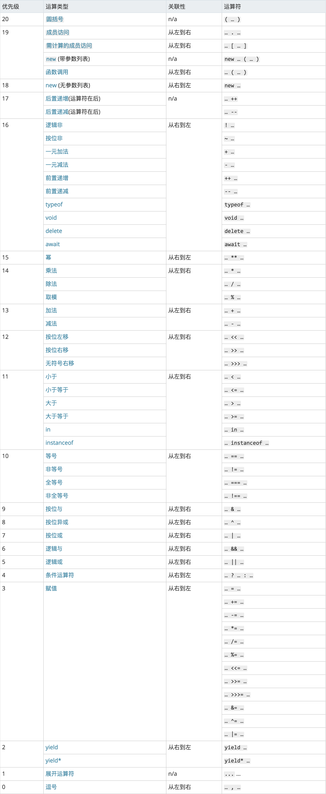

# lodash源码分析之baseFindIndex中的运算符优先级

> 我悟出权力本来就是不讲理的——蟑螂就是海米；也悟出要造反，内心必须强大到足以承受任何后果才行。
>
> ——北岛《城门开》

本文为读 lodash 源码的第十篇，后续文章会更新到这个仓库中，欢迎 star：[pocket-lodash](https://github.com/yeyuqiudeng/pocket-lodash)

gitbook也会同步仓库的更新，gitbook地址：[pocket-lodash](https://www.gitbook.com/book/yeyuqiudeng/pocket-lodash/details)

## 作用与用法

`baseFindIndex` 是内部方法，其作用类似于ES6的 `findIndex`，查找符合条件的第一个元素的索引。

`baseFindIndex` 除了从前向后查找外，还可以从后向前查找。

用法如下：

```javascript
baseFindIndex([3,1,2], function(val, index, array) {
  return val > 1
}, 1) // 从前向后查找，从索引1开始查找，返回2
baseFindIndex([3,1,2], function(val, index, array) {
  return val > 1
}, 1, true) // 从后向前查找，从索引1开始查找，返回3
```

## 源码分析

```javascript
function baseFindIndex(array, predicate, fromIndex, fromRight) {
  const { length } = array
  let index = fromIndex + (fromRight ? 1 : -1)

  while ((fromRight ? index-- : ++index < length)) {
    if (predicate(array[index], index, array)) {
      return index
    }
  }
  return -1
}
```

这段代码再次展示了 lodash 的特点，短小精悍！

这次读源码我们从里往外看。

从代码中很容易看到，`predicate` 是传递进来的函数，在 `baseFindIndex` 调用该函数，如果返回的结果为真值，则中止查找，返回索引。

### 运算符优先级

我们再往外看，看看 `while` 的循环条件：

```javascript
fromRight ? index-- : ++index < length
```

现在问题来了，这个三元表达式有两种可能，一种是：

```javascript
(fromRight ? index-- : ++index) < length
```

一种是：

```javascript
fromRight ? index-- : (++index < length)
```

究竟是那一种呢？这就要看运算符的优化级了，下面这个表是 MDN 上的截图：



这个表将优化级划分成了20个级别，数字越大，优化级越高。

从表中可以看到，比较运算符的优先级为11，而三元表达式（条件运算符）的优化级为4，因此可以确定比较运算符的优先级要比三元表达式的要高，循环条件其实等价于第二种写法。

### 增减迷局

再往上看，可以看到这句代码：

```javascript
let index = fromIndex + (fromRight ? 1 : -1)
```

在向后查找时， `index` 减少了1，而向前查找时，`index` 增加了1，为什么要这样做呢？

再结合循环条件看下：

```javascript
fromRight ? index-- : ++index < length
```

在向前查找时，使用的是 `index--` 表达式的运算结果，向后查找时，使用的是 `++index < lenth` 表达式的运算结果。

从上表中也可以看出前缀自增比比较运算符的优化级要高。

前缀自增返回的是自增后的结果，而在循环条件中就要将索引 `index` 增加1，这样会忽略掉第一个需要遍历的元素，作为补救，在开始遍历前，需要将 `index` 减少1。

同理，在向前查找时，需要将索引增加1，因为在遍历开始时就已经将索引减少1。

那又为什么向前查找时用的是后缀自减，而不是用前缀自减呢？

因为在向前查找时，最终要查找到数组索引 `0` 的位置，后缀自减返回的是自减前的数值，因此当 `index` 为 `1` 时，自减后的 `index` 为 `0` ，但是在循环条件中依然拿 `1` 来进行判断，所以使得索引 `0` 得以进入循环体。

关于前缀自增/减和后缀自增/减的区别可以看《[lodash源码分析之自减的两种形式](./assocIndexOf.md)》。

## 参考

1. [MDN:运算符优先级](https://developer.mozilla.org/zh-CN/docs/Web/JavaScript/Reference/Operators/Operator_Precedence)

## License

[署名-非商业性使用-禁止演绎 4.0 国际 (CC BY-NC-ND 4.0)](http://creativecommons.org/licenses/by-nc-nd/4.0/)

最后，所有文章都会同步发送到微信公众号上，欢迎关注,欢迎提意见：   

作者：对角另一面