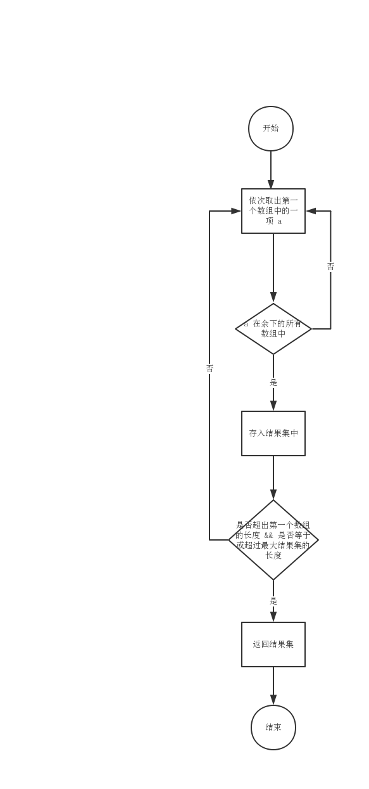

# lodash源码分析之baseIntersection

本文为读 lodash 源码的第四十四篇，后续文章会更新到这个仓库中，欢迎 star：[pocket-lodash](https://github.com/yeyuqiudeng/pocket-lodash)

gitbook也会同步仓库的更新，gitbook地址：[pocket-lodash](https://www.gitbook.com/book/yeyuqiudeng/pocket-lodash/details)

## 依赖

```javascript
import SetCache from './SetCache.js'
import arrayIncludes from './arrayIncludes.js'
import arrayIncludesWith from './arrayIncludesWith.js'
import map from '../map.js'
import cacheHas from './cacheHas.js'
```

[《lodash源码分析之缓存使用方式的进一步封装》](SetCache.md)

[《lodash源码分析之arrayIncludes》](arrayIncludes.md)

[《lodash源码分析之arrayIncludesWith》](arrayIncludesWith.md)

[《lodash源码分析之map的实现》](../map.md)

[《lodash源码分析之cacheHas》](cacheHas.md)

## 源码分析

### 作用

`baseIntersection` 的作用是找出多个数组之间的交集。

### 实现思路

#### 确定交集最大长度

多个数组的交集，最后返回的肯定是一个数组，因此先得有个容器，我们先来写出这个函数的第一个行代码

```javascript
function baseIntersection (arrays) {
  const result = []
}
```

接下来，我们确定一下交集 `result` 的最大长度，`result` 的长度肯定不传超过传入的最短数组的长度，因此只需要找出期中最短数组的长度，即可确定交集的最大长度。

```javascript
function baseIntersection (arrays) {
  const othLength = arrays.length
  const result = []
  
  let maxLength = Infinity
  let othIndex = othLength
  
  while (othIndex--) {
    array = arrays[othIndex]
    maxLength = Math.min(array.length, maxLength)
  }
}
```

#### 找出所有的交集元素

怎样才能找到所有的交集元素呢？

如果某个元素是 `arrays` 的交集元素，则肯定存在于所有的 `arrays` 中，也即必定在第一个数组中存在，反之，如果在第一个数组中不存在的元素，肯定不会是交集元素。那是不是可以这样来思考，我们一个一个地将第一个数组中的元素取出，如果这个元素在余下的所有数组中都存在，那这个元素肯定是交集元素。

流程图：



这其实就是一个嵌套循环：

```javascript
const includes = arrayIncludes
const length = arrays[0].length
let array = arrays[0]
let index = -1

outer:
while(++index < length && result.length < maxLength) {
  let value = array[index] // 将第一个数组每一项依次取出
  
  if (!includes(result, value)) {
    othIndex = othLength // 初始化为数组的总长度
    while(--othIndex) { // 从后向前遍历传入的数组
      if (!includes(arrays[othIndex], value)) { // 如果这个元素只要不在其中一个数组中，就跳出循环
        continue outer
      }
    }
    result.push(value)
  }
}
```

这样便实现了一个获取交集的函数。

#### iteratee 参数

现在 `baseIntersection` 可以找出所有数组中的交集了，但是如果有以下的数组：

```javascript
const arr1 = [1,'2',3]
const arr2 = ['1','2']
```

要求将所有的字符串转换为数字处理，再找出交集，即最后的结果为 `[1,2]` 。

如果直接使用 `baseIntersection` 来处理，最后得出来的结果肯定是 `[]` ，因此就需要第二个参数 `iteratee` 了，使用者可以传入一个 `iteratee` 函数，在 `baseIntersection` 做比较前，会遍历每个数组中的每一项，将每项的值传给这个函数，然后使用新返回的值来做比较。

因此，要达到上述的目的，只需要这样使用 `baseIntersection`:

```javascript
baseIntersection([arr1, arr2], function (value) {
  return +value
})
```

再来看看源码的实现：

```javascript
function baseIntersection (arrays, iteratee) {
  const includes = arrayIncludes
  const length = arrays[0].length
  const othLength = arrays.length
  const result = []
  
  let array
  let maxLength = Infinity
  let othIndex = othLength
  
  while (othIndex--) {
    array = arrays[othIndex]
    if (othIndex && iteratee) {
      array = map(array, (value) => iteratee(value))
    }
    maxLength = Math.min(array.length, maxLength)
  }
  
	array = arrays[0]
	let index = -1

  outer:
  while(++index < length && result.length < maxLength) {
    let value = array[index] // 将第一个数组每一项依次取出
		const computed = iteratee ? iteratee(value) : value
    
    if (!includes(result, computed)) {
      othIndex = othLength // 初始化为数组的总长度
      while(--othIndex) { // 从后向前遍历传入的数组
        if (!includes(arrays[othIndex], computed)) { // 如果这个元素只要不在其中一个数组中，就跳出循环
          continue outer
        }
      }
      result.push(value)
    }
  }
}
```

#### comparator 参数

`comparator` 参数要解决什么问题呢？比如有以下两个数组

```javascript
const arr1 = [{a: 1}, {a: 2, b: 1}]
const arr2 = [{a: 1}, {a: 2}]
```

要求只要 `a` 的值一样即可。

即可以这样调用

```javascript
baseIntersection([arr1, arr2], void 0, function (va1, va2) {
  return va1.a === va2.a
}) // [{a: 2}, {a: 2, b: 1}]
```

看看源码的实现

```javascript
function baseIntersection (arrays, iteratee, comparator) {
  const includes = comparator ? arrayIncludesWith : arrayIncludes
  const length = arrays[0].length
  const othLength = arrays.length
  const result = []
  
  let array
  let maxLength = Infinity
  let othIndex = othLength
  
  while (othIndex--) {
    array = arrays[othIndex]
    if (othIndex && iteratee) {
      array = map(array, (value) => iteratee(value))
    }
    maxLength = Math.min(array.length, maxLength)
  }
  
	array = arrays[0]
	let index = -1

  outer:
  while(++index < length && result.length < maxLength) {
    let value = array[index] // 将第一个数组每一项依次取出
		const computed = iteratee ? iteratee(value) : value
    
    value = (comparator || value !== 0) ? value : 0
    if (!includes(result, computed, comparator)) {
      othIndex = othLength // 初始化为数组的总长度
      while(--othIndex) { // 从后向前遍历传入的数组
        if (!includes(arrays[othIndex], computed, comparator)) { // 如果这个元素只要不在其中一个数组中，就跳出循环
          continue outer
        }
      }
      result.push(value)
    }
  }
}
```

可以看到，传入 `comparator` 参数后，在比较的时候是使用 `arrayIncludesWith` 函数，因为这个方法支持 `comparator` 参数。

#### cache 的实现

```javascript
function baseIntersection(arrays, iteratee, comparator) {
  const includes = comparator ? arrayIncludesWith : arrayIncludes
  const length = arrays[0].length
  const othLength = arrays.length
  const caches = new Array(othLength)
  const result = []

  let array
  let maxLength = Infinity
  let othIndex = othLength

  while (othIndex--) {
    array = arrays[othIndex]
    if (othIndex && iteratee) {
      array = map(array, (value) => iteratee(value))
    }
    maxLength = Math.min(array.length, maxLength)
    caches[othIndex] = !comparator && (iteratee || (length >= 120 && array.length >= 120))
      ? new SetCache(othIndex && array)
      : undefined
  }
  array = arrays[0]

  let index = -1
  const seen = caches[0]

  outer:
  while (++index < length && result.length < maxLength) {
    let value = array[index]
    const computed = iteratee ? iteratee(value) : value

    value = (comparator || value !== 0) ? value : 0
    if (!(seen
      ? cacheHas(seen, computed)
      : includes(result, computed, comparator)
    )) {
      othIndex = othLength
      while (--othIndex) {
        const cache = caches[othIndex]
        if (!(cache
          ? cacheHas(cache, computed)
          : includes(arrays[othIndex], computed, comparator))
        ) {
          continue outer
        }
      }
      if (seen) {
        seen.push(computed)
      }
      result.push(value)
    }
  }
  return result
}
```

可以从源码中看到，使用 `cache` 的条件如下：

```javascript
!comparator && (iteratee || (length >= 120 && array.length >= 120))
```

首先是没有传 `comparator` ，这个很容易理解，因为 `comparator` 的比较逻辑是由使用者提供的，可能会有不纯的实现，如果缓存了，会造成结果不准确。

如果有传 `iteratee` ，则使用缓存，这个判断条件不是很明白，因为依据现在的实现逻辑，`iteratee` 缓存和不缓存的调用次数都是一样的，这个缓存的判断条件好像没有什么意义。

接下来，要比较的数组长度超过 `120` 个时，缓存数组项超过 `120` 的数组，这个其实也比较好理解，数组太长的时候，嵌套循环可能会让运行的时间指数上升，使用缓存可以避免这种情况。但是 `120` 具体是怎样定下的，不是很明确。

将结果缓存好后，在比较的时候只需要用 `cacheHas` 来取出结果即可，不需要再用 `includes` 来比较。

## License

[署名-非商业性使用-禁止演绎 4.0 国际 (CC BY-NC-ND 4.0)](http://creativecommons.org/licenses/by-nc-nd/4.0/)

最后，所有文章都会同步发送到微信公众号上，欢迎关注,欢迎提意见：   

作者：对角另一面 